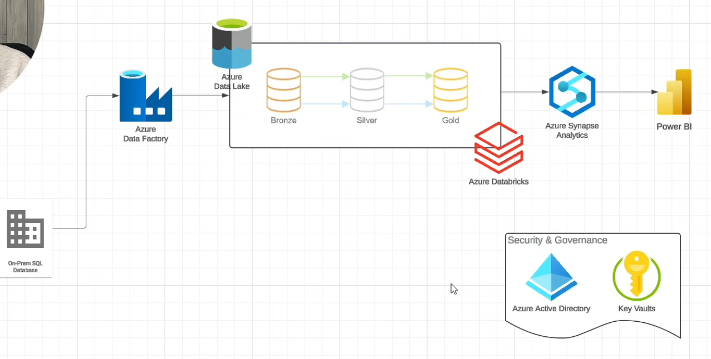
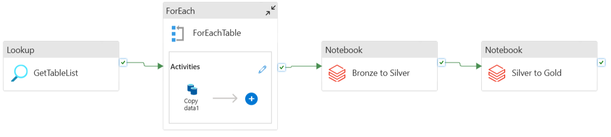
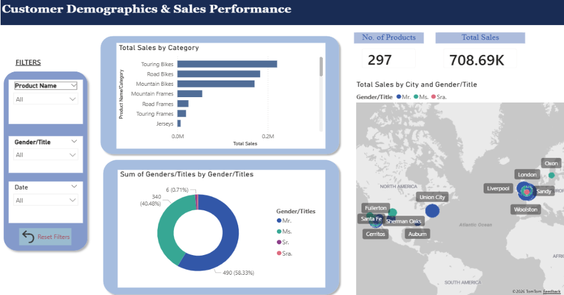

# Azure End-To-End Data Engineering Lakehouse Project 🚀

## 1. Project Summary
As part of my studies in **Special Topic in Data Engineering (SECP3843)**, I followed an end-to-end cloud data engineering tutorial using the AdventureWorks dataset to build an automated, scalable Data Lakehouse on **Microsoft Azure**. The primary objective of this solution was to eliminate a critical operational visibility gap within the company, where valuable sales data and customer records remained siloed in a local database, preventing leadership from making data-informed marketing and inventory decisions.

To resolve this issue, the pipeline implements a modern **Medallion Architecture** using **Azure Data Lake Storage (ADLS) Gen2** to orchestrate structured, reliable data workflows across three distinct phases:

* **Bronze Layer (Ingestion): Azure Data Factory (ADF)** extracts raw table records from an on-premises SQL Server environment via a Self-Hosted Integration Runtime and loads them safely into cloud storage as compressed Parquet files.

* **Silver Layer (Standardization): Azure Databricks** serves as our primary compute engine, utilizing PySpark to clean raw datasets, handle missing inputs, format messy timestamps, and save the schema structures as reliable Delta tables.

* **Gold Layer (Refinement & Consumption):** A secondary Databricks notebook applies strategic business logic (such as joining order headers with details to track product sales) and reformats columns into a reporting-ready structure. Azure Synapse Analytics then hosts serverless SQL views over these Gold directories, providing a highly cost-efficient query layer that only accumulates costs during active use.

The final output is an interactive **MS Power BI Dashboard** connected directly to the serverless Synapse pool. This dashboard centralizes the company's metrics into a unified interface, tracking Key Performance Indicators (KPIs) like total revenue, customer demographics, and product sales volume. To protect corporate cloud infrastructure, sensitive database parameters and secret connection strings were secured inside **Azure Key Vault** rather than being hardcoded directly into individual code resources.

---

## 2. System Evidence & Implementation

### Architecture Overview
The system design establishes a Cloud Data Lakehouse on Microsoft Azure following strict Medallion Design Pattern guidelines:

*Figure 1: Illustration of the proposed Azure-based data engineering Medallion pipeline.*

#### **Architecture Component Breakdown:**
* **Data Source:** A local environment running Microsoft SQL Server to hold core business transaction records.
* **Orchestration Layer:** Azure Data Factory acts as the central engine, relying on a Self-Hosted Integration Runtime to create a secure bridge between local resources and cloud databases.
* **Storage Layer (ADLS Gen2):** Divided into three clear Medallion zones to isolate raw ingestion (Bronze), clean transformations (Silver), and reporting configurations (Gold).
* **Compute & Consumption Layer:** Azure Databricks handles Spark-based data refinement, while Azure Synapse Analytics creates serverless views to fetch data with minimal performance costs.

---

### Data Pipeline Architecture
Data ingestion, multi-stage table processing loops, and sequence dependencies are programmatically controlled inside Azure Data Factory:

*Figure 2: Active Azure Data Factory resource canvas validating loop executions and notebook dependencies.*

#### **Transformation Breakdown:**
1. **Ingestion:** ADF looks at individual on-premises source tables, copies records dynamically, and partitions files down into the ADLS Gen2 Bronze layer as compressed Parquet files.
2. **Standardization:** Databricks runs PySpark notebooks to clear out formatting flaws, handle missing inputs, and map variables into uniform Delta tables under the Silver layer.
3. **Refinement & Modeling:** A second Databricks script processes complex relational tables (such as joining order headers with details), drops raw technical metadata tags, and writes refined tables to the Gold layer.

---

### Business Insights (Power BI Dashboard)
The visualization tier directly queries Synapse Serverless SQL pools to track business performance metrics:

*Figure 3: The final interactive Power BI dashboard displaying demographic insights, product performance, and KPIs.*

#### **Dashboard Capabilities Breakdown:**
* **Key Metric Tracking:** Displays critical real-time performance indicators, including Total Sales Revenue, Order Volume, and Total Product Counts.
* **Demographic Breakdown:** Features interactive charts evaluating how attributes like customer gender distribution and corporate segment titles influence specific product category purchases.
* **Pipeline Synchronization:** Validates end-to-end functionality by instantly recalculating charts when new records (such as manual SQL insertions) successfully complete their automated pipeline cycles.
---

## 3. Personal Reflection
**Name:** Chew Chiu Xian 

**Course:** Special Topic in Data Engineering (SECP3843) 

* Throughout this project, I gained deep insights into the complexities of architecting an end-to-end data pipeline in MS Azure. My primary responsibility was overseeing the Technology Use, Pipeline Architecture, and Power BI Dashboard, which allowed me to understand how these services must be synchronized to maintain data integrity. 

* A major challenge I encountered was ensuring the Silver-to-Gold transformation correctly formatted the data types so that Power BI could interpret them without errors, specifically avoiding string data-type conversion conflicts during visualization. This experience taught me the importance of a structured Medallion Architecture in preventing data silos and providing the business with actionable, real-time insights for better customer retention.

* To further optimize this solution for real-world enterprise deployment, the infrastructure configuration could be improved by reducing Databricks cluster auto-termination limits to save passive engine billing hours when processing tasks finish idling. Besides that, changing manual execution triggers over to strict time-scheduled or event-driven triggers in Azure Data Factory would allow the system to automatically absorb transactional changes on an ongoing live schedule.
