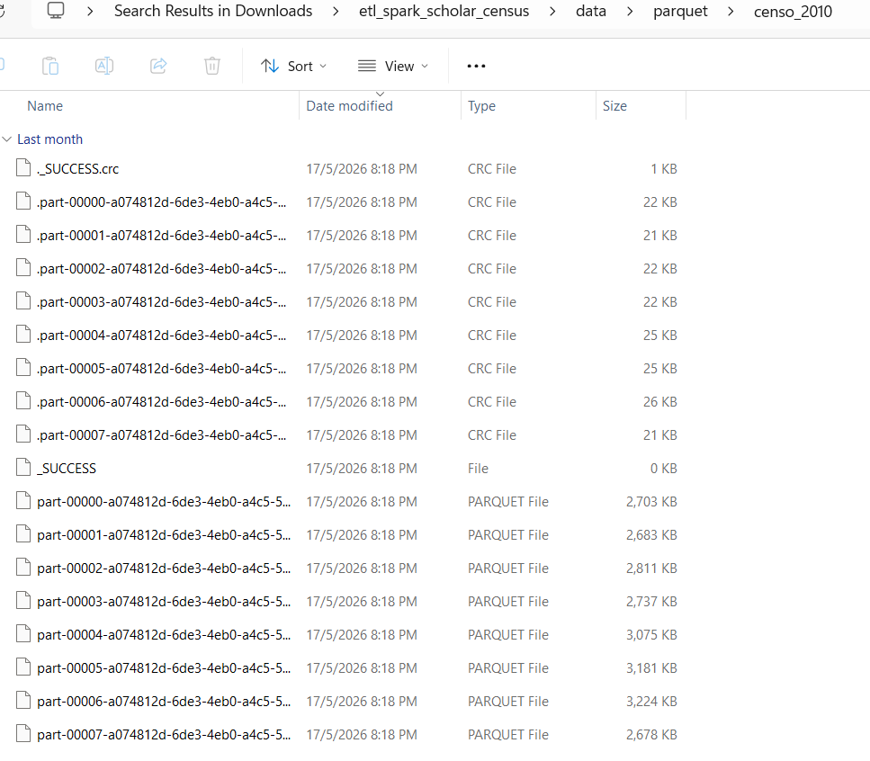
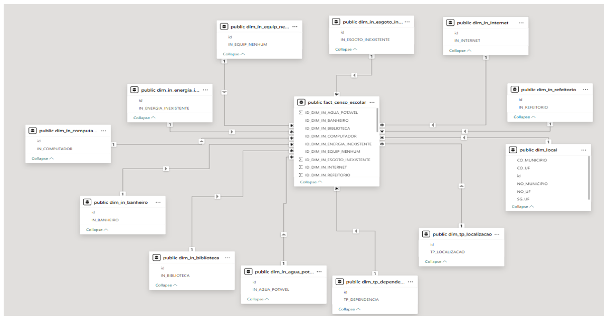
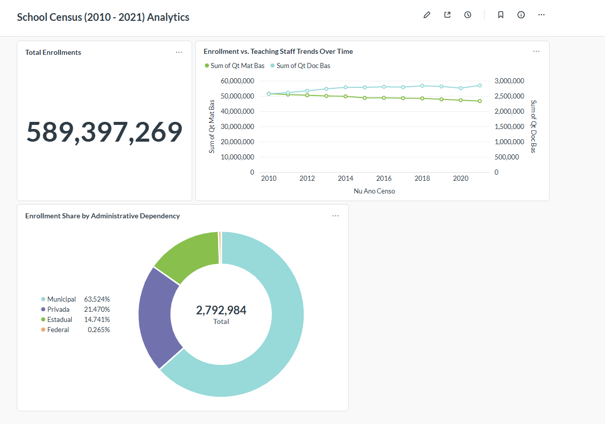

# Apache Spark End-To-End Distributed ETL & Star Schema Data Warehouse Project 🚀

## 1. Project Summary
As part of my studies in **Special Topic in Data Engineering (SECP3843)**, I engineered an end-to-end distributed data pipeline using **Apache Spark (PySpark)** to process and analyze Brazil's national school census dataset, known as the **Censo Escolar**. Published annually by Brazil's National Institute for Educational Studies and Research (INEP), this dense dataset captures infrastructure availability, enrollment metrics, and teaching staff assets across every registered school in the country over a 12-year historical horizon (2010 to 2021).

The primary business challenge addressed by this architecture was the total inability to perform efficient, large-scale educational trend analysis directly on raw, wide, and denormalized transactional CSV records. For stakeholders—including education ministries, school administrators, and policy planners—querying text-heavy, high-volume files across multiple years resulted in severe computational bottlenecks and prolonged latency during reporting.

To resolve this visibility gap, the data pipeline implements a highly scalable, multi-stage processing routine that transforms messy flat records into an optimized, query-ready relational structure:

* **Ingestion & Storage Optimization (Parquet Layer):** PySpark unifies historical schema differences across the 12 files, standardizes character encodings, and serializes the wide datasets into columnar **Apache Parquet** format using the **SNAPPY compression codec** to minimize storage footprints and leverage predicate pushdown.

* **Dimensional Modeling & Cleansing (Surrogate Key Layer):** Heavy string parameters and categorical metrics are extracted into isolated, compact lookup fields. Missing inputs and binary flag gaps are safely imputed using null-safe PySpark `coalesce` methods. To eliminate heavy text-scanning overheads, PySpark's `monotonically_increasing_id()` function translates alphanumeric geographic metrics into lightweight 64-bit integer surrogate primary keys.

* **Warehouse Loading & Consumption:** The finalized dimensions and a completely numeric central fact table (**FACT_CENSO_ESCOLAR**) are streamed via Java Database Connectivity (JDBC) into a **PostgreSQL 17** database instance. The resulting data warehouse organizes records under a strict **Star Schema Architecture**, providing an indexed, rapid reporting environment for interactive **Microsoft Power BI Dashboards**.

---

## 2. System Evidence & Implementation

### Data Pipeline Architecture & Parquet Serialization
Data transformation loops and write sequences are programmatically handled by the Spark engine, outputting directly to highly compressed columnar storage blocks:

*Figure 2: Storage layer validation verifying successful conversion of PySpark dataframes into optimized Parquet partitions.*

#### **Parquet Storage Breakdown:**
* **The `_SUCCESS` Marker:** The explicit creation of the metadata `_SUCCESS` file verifies that the distributed execution plan completed safely across all active worker blocks without runtime faults or data-split failures.
* **Partitions & Column Compression:** The wide historical census attributes are broken down into individual data part blocks, utilizing SNAPPY compression algorithms to preserve massive amounts of storage space while drastically speeding up analytical file-skipping capabilities.

---

### Relational Modeling (The Star Schema Diagram)
By applying a strict Star Schema design pattern, the database model separates structural metadata properties from numerical key performance indicators:

*Figure 3: High-fidelity entity-relationship (ER) diagram representing the optimized Star Schema warehouse setup.*

#### **Star Schema Breakdown:**
* **Central Fact Table (`fact_censo_escolar`):** Acts as the high-speed data foundation, hosting only direct numerical measurements, student capacity numbers, and quantitative indicators along with their associated dimension lookup foreign keys.
* **Dimension Tables (`dim_local`, `dim_escola`, `dim_infraestrutura`):** Flank the core fact table to hold descriptive attributes (such as regional locations, municipal categories, and facility statuses), using lightweight integer surrogate keys to replace heavy string search penalties.

---

### Business Insights (Power BI Dashboard)
The presentation layer queries the final PostgreSQL data warehouse tables, leveraging the pre-joined relationships to stream lightning-fast visual charts:

*Figure 4: Interactive analytics environment displaying longitudinal educational metrics and structural school breakdowns.*

#### **Dashboard Capabilities Breakdown:**
* **Longitudinal Aggregations:** Aggregates macro student performance and regional enrollment totals across the entire 12-year operational horizon without suffering lag or database timeouts.
* **Proportional Insights & Funnels:** Visualizes crucial educational trends, school facility distributions, and digital connectivity deficits by routing filters seamlessly through the Star Schema keys.

---

## 3. Personal Reflection

**Name:** Chew Chiu Xian

**Course:** Special Topic in Data Engineering (SECP3843)

* Throughout this project, I gained deep technical insights into bridging the theoretical foundations of database normalization with practical, distributed data engineering. My primary exposure involved developing the core ETL data processing pipelines and configuring downstream BI visualization components, allowing me to understand how big data engines like Apache Spark must interact with relational targets to preserve overall transactional accuracy.

* A major architectural challenge I encountered involved handling a set of small structural anomalies—specifically duplicate tracking tables and corrupt backup files—that compromised our metadata catalogue during initial deployments. Rather than executing an expensive, slow schema rollback that would completely stall our team's development velocity, I applied targeted data governance principles directly within the business intelligence semantic layer. Hiding conflicting column visibility properties and remapping dimension lookup keys resolved these anomalies efficiently while maintaining project momentum.

* To further optimize this analytical pipeline for real-world production deployment, the localized architecture could be upgraded by migrating the script from a single local driver node into a cloud-managed cluster environment like Azure Databricks or AWS EMR. This change would separate memory overhead allocations across multiple worker threads to completely eliminate local Java Heap memory spikes. Furthermore, integrating an orchestration framework like Apache Airflow or Azure Data Factory would automate batch ingestion triggers on an ongoing live schedule without requiring human intervention.
