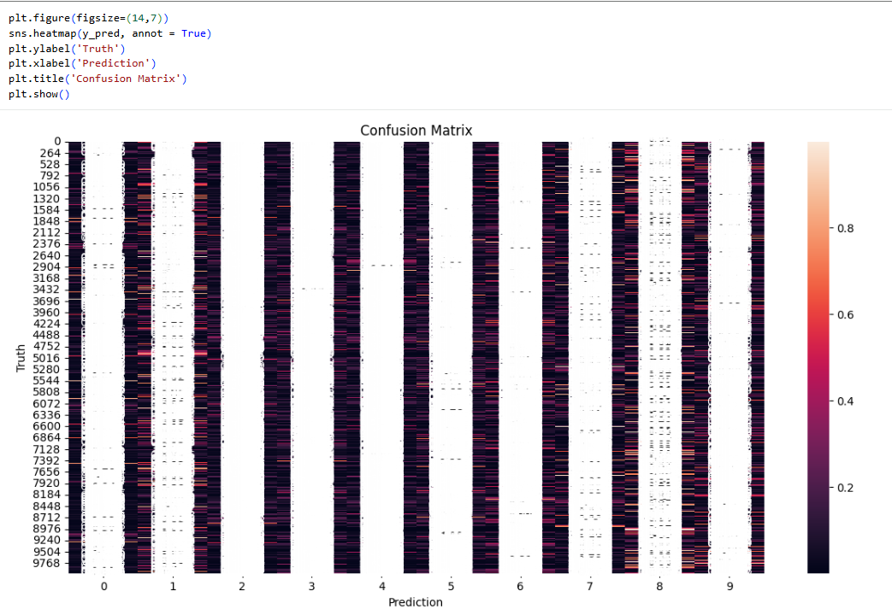
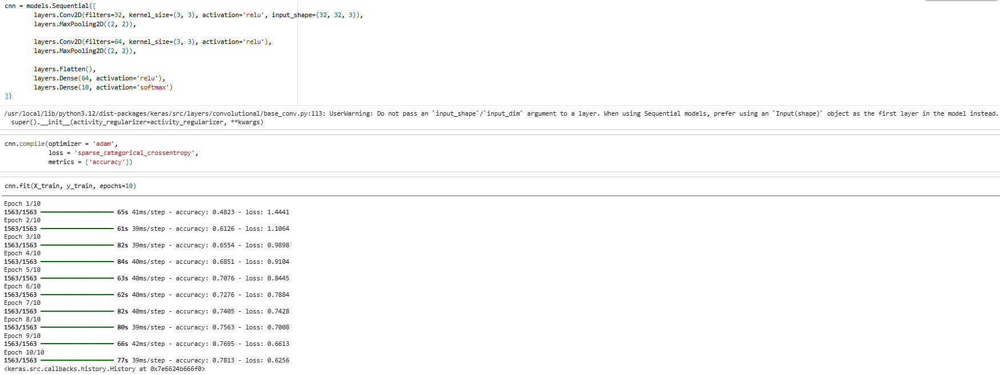
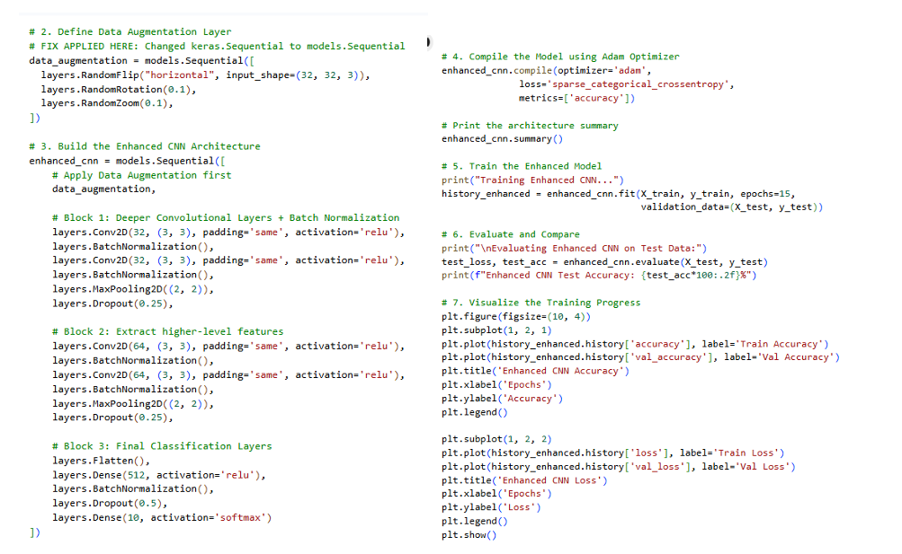

# CIFAR-10 Image Classification: Deep Learning CNN & Enhanced Regularization Pipeline 🚀

## 1. Project Summary
As part of my studies in **Special Topic in Data Engineering (SECP3843)**, I engineered an image classification pipeline using **Python and TensorFlow/Keras** to categorize structured grid data from the classic **CIFAR-10 dataset**. Comprising 60,000 low-resolution (32x32 pixel) color images spanning 10 distinct categorical classes (such as airplanes, automobiles, birds, and trucks), this dataset serves as a benchmark for training deep learning architectures to map complex multi-dimensional numerical pixel arrays into discrete target labels.

The primary engineering challenge addressed in this study was the severe architectural limitation and high variance trajectory observed in baseline networks. Initial implementations using a flat Artificial Neural Network (ANN) and a shallow Convolutional Neural Network (CNN) lacked the structural depth and regularization constraints needed to generalize effectively on unseen data. The baseline CNN suffered from a noticeable overfitting variance delta, driven by the network's tendency to memorize static background noise and rigid spatial coordinates rather than extracting abstract geometric features.

To eliminate these computational bottlenecks and close the generalization gap, an advanced processing pipeline designated as **New_CNN** was designed and executed, integrating state-of-the-art regularization, scaling, and architectural enhancement blocks:

* **On-The-Fly Data Augmentation (Spatial Invariance Layer):** To inject spatial robustness, a dynamic transformation sequence applies real-time horizontal symmetry flips (`RandomFlip`), spatial rotations (`RandomRotation(0.1)`), and zoom distortions (`RandomZoom(0.1)`) across training iterations, forcing the network's feature filters to prioritize abstract contours over absolute coordinates.

* **Stacked Convolutional Backbone & Gradient Stabilization:** The shallow baseline layout is upgraded to a deeper architecture featuring consecutive pairs of 32-filter and 64-filter convolutional layers (`Conv2D`). To smooth out the loss landscape and combat internal covariate shifts, **Batch Normalization** layers are injected systematically after each feature execution path, preventing gradient explosions and accelerating stable weight convergence.

* **Multi-Tiered Regularization Defenses:** Severe regularization thresholds are deployed to restrict raw parameter memorization. Early-stage 25% **Dropout** barriers are placed following spatial `MaxPooling2D` blocks to suppress node co-dependencies, alongside an expanded dense layer capped by a final 50% Dropout barrier. This structure traded raw training acceleration for an exceptional optimization curve, almost completely closing the overfitting variance delta.

---

## 2. System Evidence & Implementation

### Confusion Matrix
To properly evaluate the true categorical classification power and identify exactly which visual classes the network was confusing, a confusion matrix alongside a classification report was utilized.

  
*Figure 1: Confusion Matrix evaluating testing dataset accuracy against true labels.*

**Explanation:** This matrix offers a tabular layout displaying actual versus predicted classes. By generating this mathematical output via the `sklearn.metrics` library, it becomes possible to diagnose spatial blind spots. It reveals precisely how often the model misclassifies items sharing similar visual silhouettes, such as confusing "automobile" contours with "truck" boundaries, guiding the necessity for further spatial augmentation.

---

### Code and Training Logs for the Baseline CNN Model
Before optimizing the final architecture, a baseline Convolutional Neural Network (CNN) was established to handle spatial pixel data properly and track initial accuracy metrics.

  
*Figure 2: Code and Training Logs for the Baseline CNN Model.*

**Explanation:** This baseline model introduces fundamental spatial extraction using `layers.Conv2D` with ReLU activation and `layers.MaxPooling2D` for down-sampling. Compiled with the Adam optimizer and trained over 10 epochs, the logs reveal an initial training accuracy of around 78.13% but a testing accuracy stalling at 69.89%. This resulting 8.24% variance delta explicitly signals that the shallow architecture is heavily overfitting to the training noise.

---

### Code Implementation for the Enhancement of the CNN Model (New_CNN)
To systemically resolve the baseline's tendency to overfit and its lack of spatial robustness, an upgraded architectural pipeline designated as `New_CNN` was engineered.

  
*Figure 3: Code Implementation for the Enhancement of the CNN Model (New_CNN).*

**Explanation:** This implementation block features a robust, multi-tiered defense against raw memorization. The code explicitly wraps the input in a `models.Sequential` data augmentation pipeline to continuously distort training batches dynamically. It further incorporates deeper consecutive convolutional blocks, explicit `BatchNormalization` for smooth gradient convergence, and strategically placed `Dropout` layers. These combined structural enhancements suppress training noise, successfully bringing the overfitting variance delta down to a tightly aligned 0.69% while boosting true test dataset generalization.

---

## 3. Personal Reflection

**Name:** Chew Chiu Xian

**Course:** Special Topic in Data Engineering (SECP3843)

* Through this tutorial, I gained hands-on experience building, tuning, and debugging deep learning pipelines with TensorFlow and Keras. Moving away from textbook definitions to see how kernel updates, max-pooling, and backpropagation look during real-time model training gave me a much stronger understanding of neural networks. I also learned exactly how much data preprocessing, network layer depth, and regularization settings matter when trying to keep testing accuracy high under fixed hardware limits.

* A major breakthrough happened when I had to solve a code error caused by an incorrect syntax format in our sequential layout. I fixed the issue by remapping our data transformation steps using an explicit `models.Sequential` wrapper, which taught me how vital correct API syntax is. Analyzing the final training curves also showed me that keeping early dropout layers conservative is essential for protecting early feature rules, and that exploring more advanced transfer learning architectures like ResNet50 will be the best path forward for scaling up future vision systems.
