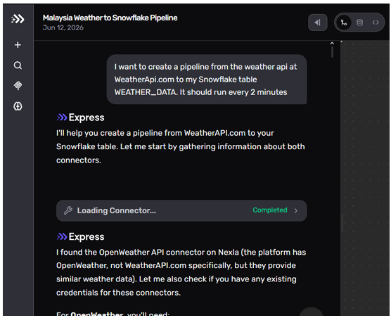
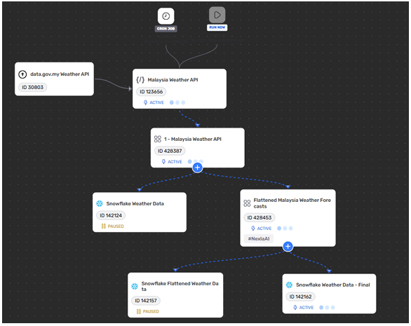
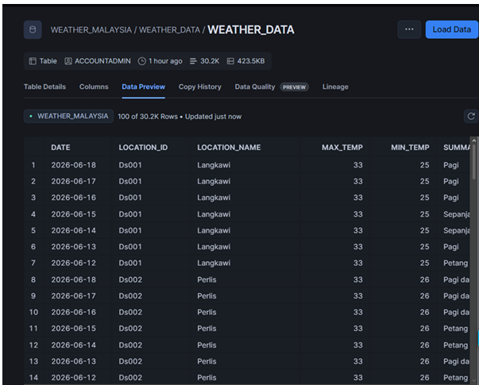

# AI-Assisted Weather Data Pipeline: Express.dev to Snowflake Data Warehouse 🌤️❄️

## 1. Project Summary
As part of my studies in **Special Topic in Data Engineering (SECP3843)**, this project demonstrates an **AI-assisted data engineering** approach to design, build, and deploy an automated end-to-end ETL data pipeline. Instead of manually writing data connector scripts or configuring complex extract-transform-load (ETL) code line-by-line, this pipeline leverages natural language prompts and autonomous AI agents to manage data ingestion. The system is designed to continuously ingest live forecast data from the **Malaysia Weather API (data.gov.my)** and stream it directly into a **Snowflake data warehouse**.

The architectural backbone of this pipeline relies on **express.dev’s built-in AI assistant (Express)**. The AI agent interprets human intent regarding data sources, destination schemas, scheduling rules, and payload transformations, translating conversational text into a fully operational execution graph on a visual canvas. 

During development, two major engineering roadblocks were encountered and resolved through interactive AI diagnostics:
* **Account Identifier Discrepancy:** The initial validation stage failed with a Snowflake credential authentication error. By systematically executing diagnostic commands (`SHOW WAREHOUSES`, `SHOW DATABASES`, `SELECT CURRENT_ROLE()`) in collaboration with the AI agent, the team isolated the issue and resolved the authentication bottleneck by correcting the account identifier format.
* **Nested JSON Structural Mismatch:** Once connected, the raw API payload returned data wrapped inside a nested JSON array, which caused all relational columns in the target destination table to populate as `null` values. The AI agent diagnosed this structural breakdown and autonomously generated an in-memory transformation layer to unpack and flatten the nested array into structured rows and columns compatible with the relational database schema.

---

## 2. System Evidence & Implementation

### Prompting the AI Agent in Express.dev
The pipeline was initialized entirely through a single natural language instruction conversational interface, removing the need for manual boilerplate coding.

*Figure 1: Prompting the AI agent in express.dev.*

**Explanation:** This step shows the initial interaction where the prompt *"I want to create a pipeline from the weather API at data.gov.my to my Snowflake table WEATHER_DATA. It should run every 2 minutes."* was submitted to the Express AI assistant. The agent successfully interpreted the target destination details, automatically located the appropriate weather data connectors, and initialized the background infrastructure components.

---

### AI-Generated ETL Data Pipeline Flow Canvas in Express.dev
Once the parameters and transformations were defined, the AI agent rendered the complete execution graph showing how data streams dynamically from source to sink.

*Figure 2: AI-Generated ETL Data Pipeline Flow Canvas in Express.dev.*

**Explanation:** This canvas illustrates the end-to-end structural flow of the operational pipeline. It visualizes the automated Cron Job trigger block (set to a 2-minute interval execution cadence), the source data node pulling from the Malaysia Weather API, the critical `Flattened Malaysia Weather Forecasts` node that expands the nested JSON arrays, and the final ingestion endpoints pushing to the Snowflake target tables.

---

### Data Ingestion Verification in Snowflake
To verify that the pipeline transformations succeeded, a live data preview was pulled from inside the target data warehouse.

*Figure 3: Data preview in Snowflake confirming successful ingestion of Malaysia weather data.*

**Explanation:** This data preview confirms that the end-to-end data pipeline is operating successfully. The table displays 30,200 rows of records (totaling 423.5 KB) smoothly ingested from the weather API into the destination environment. Crucially, because the AI-generated flattening transformation map worked correctly, every target relational column—such as `DATE`, `LOCATION_ID`, `LOCATION_NAME`, `MAX_TEMP`, and `MIN_TEMP`—is fully populated with clean, structured data instead of empty null values.

---

## 3. Personal Reflection

**Name:** Chew Chiu Xian

**Course:** Special Topic in Data Engineering (SECP3843)

* Completing this tutorial gave me fantastic hands-on experience building automated data workflows using AI-assisted engineering tools like Express AI. It was incredible to see how easily high-level project goals can be instantly turned into real pipeline architectures without having to type out long configurations or write backend code line-by-line.

* A major milestone for me was tackling the data quality issue where the incoming API records were trapped in a complex, nested JSON format that caused empty null values in our database. Working with the AI to diagnose the mismatch and seeing it automatically write an unpacking rule to flatten that data into neat, usable database columns was a huge breakthrough. Ultimately, this project clearly proved how efficient AI-driven tools are at handling messy backend setups, allowing data engineers to focus more on system design and logic.
