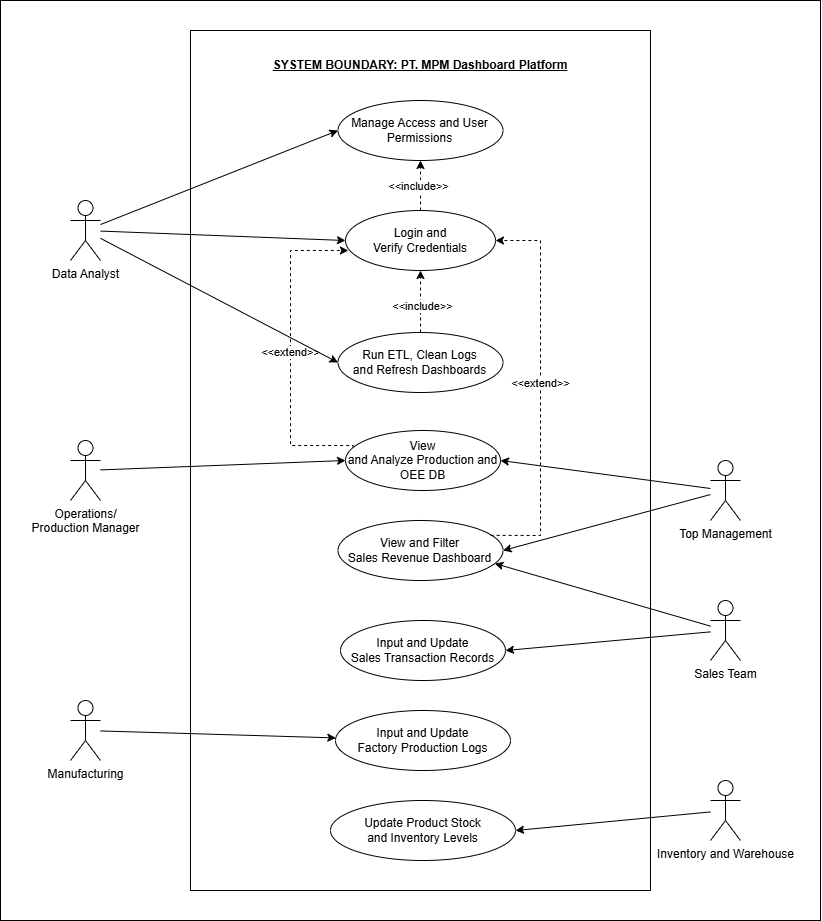
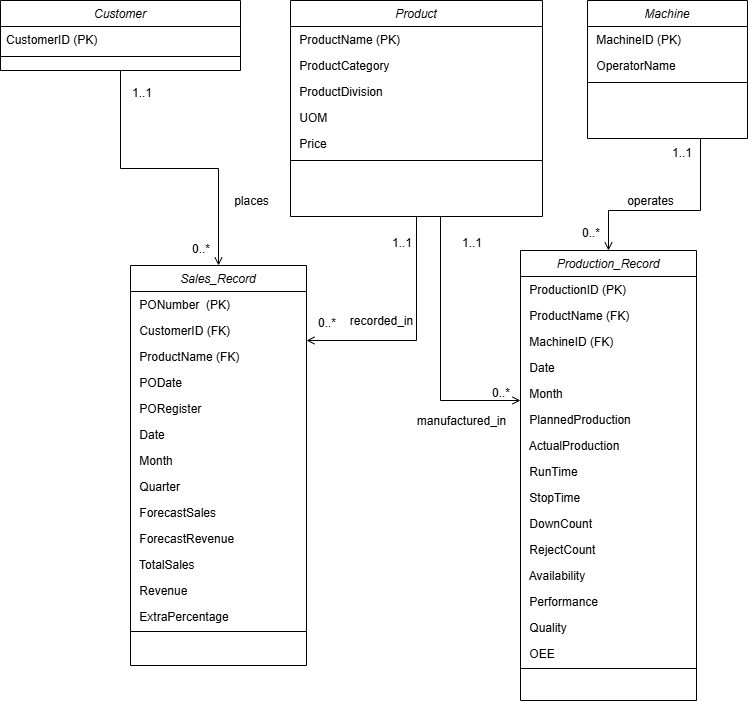
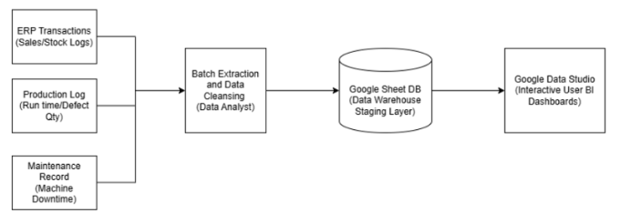
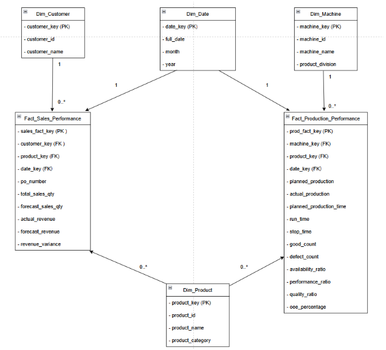

# PT. MPM Enterprise Business Intelligence Platform: Multi-Fact Data Warehouse & Galaxy Schema Pipeline 📊🏭

## 1. Project Summary
This project delivers an enterprise-grade Business Intelligence (BI) and Data Engineering solution for **PT. MPM**, an Indonesian regional packaging manufacturer. Historically, PT. MPM suffered from operational blind spots caused by highly fragmented data silos across sales, manufacturing, inventory, and warehouse departments. Without a centralized monitoring system, management lacked visibility into real-time Key Performance Indicators (KPIs) and Overall Equipment Effectiveness (OEE), forcing critical corporate decisions to be made using unstructured and unreliable data.

To resolve these bottlenecks, this pipeline implements an end-to-end data warehousing architecture that extracts raw transactional records, processes them through an institutional ETL layer, and structures them into an analytical **Galaxy Schema (Fact-Constellation)**. The core engine bridges two major operational areas:
* **Sales Revenue Optimization:** Tracks order performance, pricing variations, and customer distribution channels to maximize revenue generation.
* **Production Line Efficiency:** Monitors manufacturing lines by tracking operational metrics (shift hours, downtime logs, defect rates) to dynamically calculate live **OEE scores** (Availability, Performance, and Quality).

By linking these distinct business processes using **Conformed Shared Dimensions** (`Dim_Product` and `Dim_Date`), the architecture allows cross-departmental queries. This means management can directly analyze how production-line slowdowns or equipment failures impact sales delivery timelines within a single unified dashboard platform.

---

## 2. System Evidence & Implementation

### Use Case Diagram
The operational boundaries, user privileges, and functional requirements of the analytical dashboard system were mapped out using a standardized use case layout.

*Figure 1: Use Case Diagram for the PT. MPM Performance Monitoring System.*

**Explanation:** This diagram defines how different actors interact with the BI platform. It distinguishes between the operational needs of Department Supervisors (who enter daily shift reports and sales records) and the analytical needs of Executive Management (who require broad read-access to high-level KPIs, production OEE heatmaps, and sales forecast reports to make strategic data-driven decisions).

---

### ERD UML Diagram
Before consolidating data into a warehouse, the operational transaction system (OLTP) database structure was designed to track clean relational attributes.

*Figure 2: Entity-Relationship Diagram (ERD) using UML Notation for the source database.*

**Explanation:** This diagram captures the normalized relational schema of the operational business units. It enforces strict data constraints and foreign key mappings between entities such as customers, orders, warehouse products, raw machinery logs, and shift schedules, ensuring that source data is systematically organized before entering the staging pipeline.

---

### Data System and Architecture
The overall end-to-end data movement pipeline illustrates how raw transactional entries transform into polished executive visual insights.

*Figure 3: Data Pipeline Architecture from Source Systems to BI Semantic Layer.*

**Explanation:** This architecture diagram outlines the data journey. Raw departmental inputs (CSV records, operational SQL databases) travel into an ingestion layer, pass through severe data cleaning stages inside a staging zone, load into centralized data warehouse star schemas, and finally feed clean datasets into the semantic BI dashboard layer for real-time visualization.

---

### Galaxy Schema: Sales & Production Performance Diagram
To allow fast, multi-dimensional business queries without duplicate storage or mismatched data rows, a Galaxy Schema design was developed.

*Figure 4: Galaxy Schema Constellation modeling Sales and Production performance.*

**Explanation:** This diagram highlights the core analytics layout, featuring two centralized fact tables (`Fact_Sales` and `Fact_Production_OEE`). Crucially, they share conformed dimensions for **Products** and **Dates**. This advanced design ensures that any structural changes propagate uniformly across both domains, enabling seamless queries that cross-examine manufacturing output directly against sales trends.

---

## 3. Personal Reflection

**Name:** Chew Chiu Xian

**Course:** Special Topic in Data Engineering (SECP3843)

* Working on this project gave me an excellent understanding of how to solve real-world data fragmentation problems in manufacturing environments. I learned how to transition from traditional, messy operational databases into a clean, centralized data warehouse system. Modeling a Galaxy Schema taught me how to handle complex metrics like production OEE and sales figures together, making it much easier for business leaders to see the big picture.

* My biggest breakthrough was understanding the importance of conformed shared dimensions, specifically linking products and dates across multiple fact tables. It was highly satisfying to see how this architecture eliminates data duplication and prevents matching errors when connecting separate departments. This experience gave me solid, practical data modeling skills that are directly applicable to building industrial-grade business intelligence platforms.
